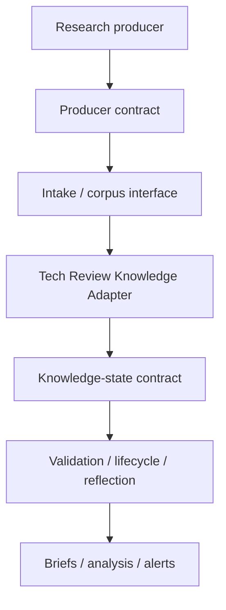

# Theseus Tech Review Graph

Public reference implementation of **Theseus KnowledgeOps / informational CI/CD**.

The first vertical is technology-review intelligence, but the architecture is defined by **roles and contracts**, not by the products currently filling those roles.

## Core invariant

```text
contracts + schemas + provenance + lifecycle rules + reproducible transformations
```

must survive replacement of:

```text
ChatGPT + Grok + Notion + Basic Memory
```

If every current product were replaced tomorrow, a new agent should be able to reconstruct the intended pipeline from this repository alone.

## Reference pipeline



Current implementations are historical choices:

- producers: ChatGPT scheduled tasks, Grok automations;
- intake/corpus: Notion;
- adapter implementation: `memory-tech-brief`;
- knowledge-state backend: Basic Memory `personal/tech-review-graph`;
- public specification and CI: GitHub.

None is architecturally mandatory.

## What v0.1 contains

- public architecture and authority boundaries;
- epistemic and lifecycle contracts;
- JSON Schemas for `Signal`, `Source`, `Actor`, `Theme`, `Brief`, and `Analysis`;
- fully synthetic reference examples;
- deterministic local validation;
- GitHub Actions running the same validation.

## What v0.1 deliberately does not contain

No automatic Notion ingestion, Basic Memory synchronization, crawler, vector database, LLM judge, automatic FACT promotion, or autonomous publication.

## Documentation

- [Architecture](docs/architecture.md)
- [KnowledgeOps](docs/knowledgeops.md)
- [Epistemic contract](docs/epistemic-contract.md)
- [Lifecycle](docs/lifecycle.md)
- [Intake contract](docs/intake-contract.md)
- [Tech Review Knowledge Adapter](docs/tech-review-knowledge-adapter.md)
- [Approved design spec](docs/superpowers/specs/2026-09-04-theseus-tech-review-graph-design.md)
