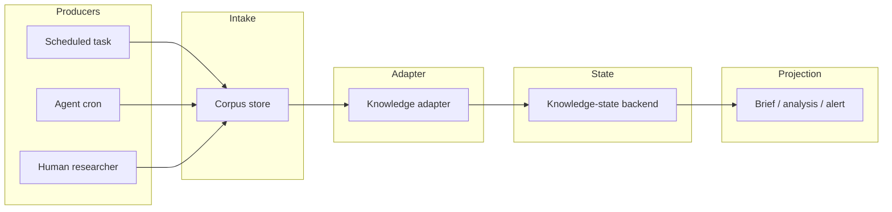

# Architecture

## Replaceable modules

Every box is replaceable. Compatibility is defined by the contract crossing each boundary.

## Current implementation map

| Role | Current implementation | Architectural requirement? |
|---|---|---|
| Research producer | ChatGPT tasks, Grok automations | No |
| Intake / corpus | Notion | No |
| Knowledge adapter | `memory-tech-brief` | No |
| Knowledge state | Basic Memory | No |
| Public specification | GitHub | No, but v0.1 is hosted here |

Notion was selected historically because its connector worked reliably across both ChatGPT and Grok. Basic Memory was selected because its memory graph, documentation, and skill/workflow corpus made it practical to derive Theseus adaptations. These are provenance facts, not permanent dependencies.

## Authority boundaries

- **Producer** proposes or collects evidence.
- **Intake** preserves a human-readable corpus; presence is not verification.
- **Adapter** normalizes and classifies candidate knowledge.
- **Knowledge state** stores evolving semantic state and relations.
- **Projection** derives briefs or analysis from state.
- **Public specification** defines contracts and reproducible validation.

No transport success implies semantic authority.
