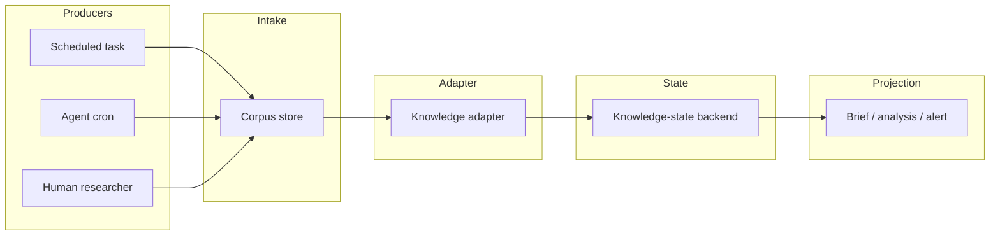
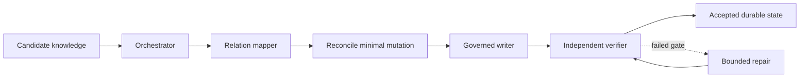

# Architecture

## Replaceable modules

```mermaid
flowchart LR
    subgraph Producers
      P1[Scheduled task]
      P2[Agent cron]
      P3[Human researcher]
    end
    subgraph Intake
      I1[Corpus store]
    end
    subgraph Adapter
      A1[Knowledge adapter]
    end
    subgraph State
      S1[Knowledge-state backend]
    end
    subgraph Projection
      O1[Brief / analysis / alert]
    end
    P1 --> I1
    P2 --> I1
    P3 --> I1
    I1 --> A1 --> S1 --> O1
```

Every box is replaceable. Compatibility is defined by the contract crossing each boundary.

## Historical implementation map for the technology-review vertical

| Role | Historical/reference implementation | Architectural requirement? |
|---|---|---|
| Research producer | ChatGPT tasks, Grok automations | No |
| Intake / corpus | Notion | No |
| Knowledge adapter | `memory-tech-brief` | No |
| Knowledge state | Basic Memory | No |
| Public specification | GitHub | No, but v0.1 is hosted here |

Notion was selected historically because its connector worked reliably across both ChatGPT and Grok. Basic Memory was selected because its memory graph, documentation, and skill/workflow corpus made it practical to derive Theseus adaptations. These are provenance facts, not permanent dependencies. This table does not establish current program-wide Theseus runtime state.

## Authority boundaries

- **Producer** proposes or collects evidence.
- **Intake** preserves a human-readable corpus; presence is not verification.
- **Adapter** normalizes and classifies candidate knowledge.
- **Knowledge state** stores evolving semantic state and relations.
- **Projection** derives briefs or analysis from state.
- **Public specification** defines contracts and reproducible validation.

No transport success implies semantic authority.

## Experimental Knowledge Orchestration Plane

Research issue [#5](https://github.com/TeaShaman-cyber/theseus-tech-review-graph/issues/5)
adds an experimental control plane around durable knowledge mutation:

```mermaid
flowchart LR
    C[Candidate knowledge] --> O[Orchestrator]
    O --> M[Relation mapper]
    M --> R[Reconcile minimal mutation]
    R --> W[Governed writer]
    W --> V[Independent verifier]
    V --> S[Accepted durable state]
    V -. failed gate .-> B[Bounded repair]
    B --> V
```

This extends the existing replaceable-module architecture without changing
authority. Relation mapping is advisory; the writer performs only authorized
mutations; acceptance requires an observable verified postcondition.

Providers observed in the 2026-09-08 reference run, such as Graph Mode, Ace Knowledge Graph, GitHub, and
MarcoPolo, are operational examples, not architectural requirements or claims about current program-wide runtime state. The full
experimental contract is in
[Knowledge Orchestration Plane](knowledge-orchestration-plane.md).
