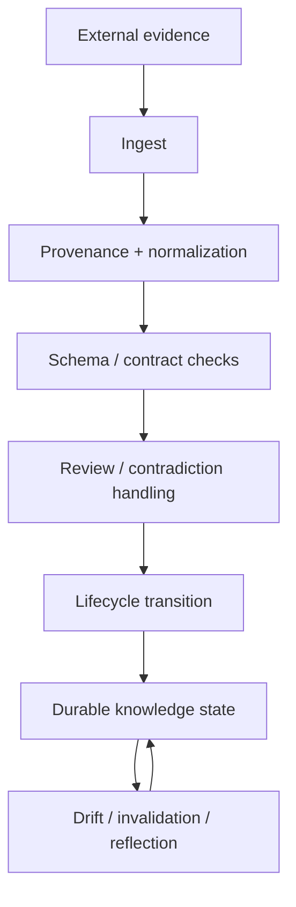

# KnowledgeOps

KnowledgeOps treats changing knowledge as maintained state rather than a pile of documents.



Historical stage names used in the current Basic Memory adaptation are:

```text
memory-ingest -> memory-schema -> memory-tasks -> memory-lifecycle -> memory-reflect
```

The names preserve origin; the stage contracts are vendor-neutral.

## Informational CI/CD analogy

| Software CI/CD | KnowledgeOps |
|---|---|
| source commit | new evidence |
| git history | provenance |
| parser/build | ingest |
| schema/type tests | structural knowledge checks |
| integration tests | relation/evidence checks |
| review | epistemic review |
| release candidate | reviewed knowledge |
| deployment | current knowledge |
| monitoring | drift detection |
| rollback | invalidation/supersession |
| release notes | brief/reflection |

Schema validity proves shape, not truth. A validator may prove that a `Signal` has a source and legal states; it cannot prove the underlying claim is factually correct.
