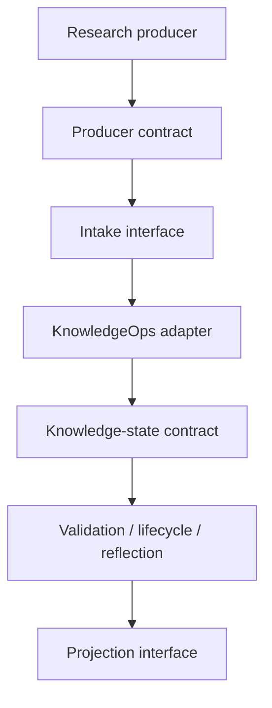
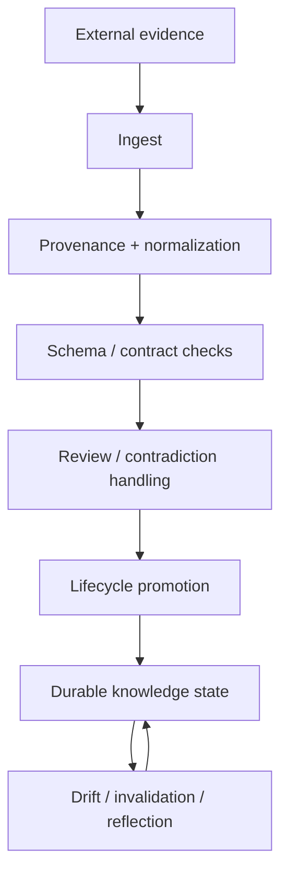
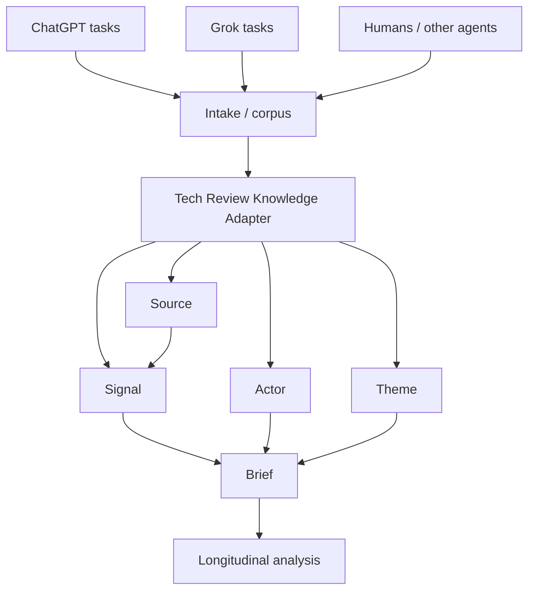

# Theseus Tech Review Graph — Design Specification v0.1

**Status:** APPROVED  
**Date:** 2026-09-04

## Purpose

`TeaShaman-cyber/theseus-tech-review-graph` is a public reference implementation of Theseus-style **KnowledgeOps / informational CI/CD**.

The first concrete vertical is a technology-review pipeline. The architecture is defined by roles and contracts, not current products.

## Replaceable-module principle

Current implementations exist for historical and practical reasons:

| Architectural role | Current implementation | Why it is used today |
|---|---|---|
| Research producers | ChatGPT scheduled tasks, Grok automations | Existing automated research loops |
| Intake / corpus layer | Notion | Stable cross-agent connector surface used by both ChatGPT and Grok |
| KnowledgeOps adapter | `memory-tech-brief` | Theseus adaptation of documented memory/research workflows |
| Knowledge-state layer | Basic Memory | Graph-oriented memory plus a strong corpus of documented skills/workflows |
| Reproducibility/specification | GitHub | Public contracts, schemas, validators, history, CI |
| Reflection / projections | Briefs, analysis, reports | Human- and agent-readable projections of evolving state |

None of these products is architecturally mandatory.



A conforming implementation may replace any module if the relevant contracts remain satisfied.

## Historical implementation provenance

Notion became the current intake surface because its connector has been comparatively stable across both ChatGPT and Grok, allowing both systems to read and write the same human-visible corpus with low integration friction.

Basic Memory became the current knowledge-state implementation because it provided persistence and graph-oriented retrieval together with a strong body of documented skills and workflows. Those materials supplied design patterns for Theseus adaptations including `memory-tech-brief`, ingest, research, schema, lifecycle, reflection, and maintenance.

These are implementation advantages, not architectural invariants.

## Core KnowledgeOps pipeline



The generic stages are:

```text
memory-ingest
  -> memory-schema
  -> memory-tasks
  -> memory-lifecycle
  -> memory-reflect
```

The names are historical. The stage contracts must not require Basic Memory.

## Tech-review vertical



`memory-tech-brief` is the current implementation of the **Tech Review Knowledge Adapter** role. The role name is vendor-neutral; the implementation name preserves provenance.

## Authority boundaries

### Intake / corpus layer

Current implementation: Notion.

Role: human-readable intake/corpus/editorial projection. Presence in the intake layer does not make a claim verified.

### Knowledge-state layer

Current implementation: Basic Memory project `personal/tech-review-graph`.

Role: live evolving semantic state and relations. Core entities are `Signal`, `Source`, `Actor`, `Theme`, `Brief`, and `Analysis`.

### Public specification layer

Current implementation: GitHub.

Role: contracts, schemas, validators, synthetic examples, CI and change history. It must not become an automatic dump of private memory contents.

## Epistemic contract

Initial public epistemic states:

- `FACT`
- `INFERENCE`
- `HYPOTHESIS`
- `UNVERIFIED`
- `DEGRADED`

Definitions:

- **FACT** — supported by evidence appropriate for the claim.
- **INFERENCE** — derived from facts but not directly stated by the evidence.
- **HYPOTHESIS** — testable proposed explanation or predicted relation.
- **UNVERIFIED** — useful candidate information that has not passed the required verification boundary.
- **DEGRADED** — evidence was obtained through a weaker-than-preferred route or with a known verification limitation.

A pipeline must never silently promote `UNVERIFIED -> FACT` because prose appears plausible.

## Temporal/currentness contract

Epistemic state and currentness are separate axes.

Currentness lifecycle:

```text
CANDIDATE -> REVIEWED -> VERIFIED -> CURRENT
                                  -> STALE
                                  -> INVALIDATED
                                  -> HISTORICAL
```

`VERIFIED + HISTORICAL` is valid. `FACT` is not synonymous with `CURRENT`.

## Core entities

- `Signal` — bounded claim/event observation with provenance and epistemic state.
- `Source` — stable source identity and source class.
- `Actor` — organization, project, person, model family, or other relevant actor.
- `Theme` — persistent topic/trend used for longitudinal grouping.
- `Brief` — projection over a bounded set of signals/themes; not the authority graph itself.
- `Analysis` — derived synthesis, comparison or longitudinal interpretation.

## Public/private boundary

The repository may contain generic schemas, algorithms, public-source examples, synthetic examples and explicitly selected public cases.

It must not bulk-export personal notes, unrelated memory, credentials, private research state, or internal connector metadata.

## Informational CI/CD analogy

| Software CI/CD | KnowledgeOps |
|---|---|
| source commit | new evidence |
| git history | provenance |
| parser/build | ingest |
| schema/type tests | knowledge schema checks |
| unit/integration tests | evidence/relation checks |
| code review | epistemic review |
| release candidate | reviewed knowledge |
| deployment | current knowledge |
| monitoring | drift detection |
| rollback | invalidation/supersession |
| release notes | brief/reflection |

Knowledge is maintained state, not static documentation.

## Theseus invariant

The durable asset is:

```text
contracts + schemas + provenance + lifecycle rules + reproducible transformations
```

not:

```text
Notion + Basic Memory + ChatGPT + Grok
```

If every current product were replaced tomorrow, a new agent must be able to reconstruct the intended KnowledgeOps pipeline from this public repository alone.

## v0.1 scope

v0.1 includes:

1. public architecture and contracts;
2. JSON Schemas for the core entities;
3. fully synthetic examples;
4. a small deterministic validator;
5. GitHub CI validating examples and schemas.

v0.1 does not include automatic Notion ingestion, Basic Memory synchronization, crawlers, vector databases, dashboards, LLM judges, automatic FACT promotion or autonomous publication.

## Acceptance criteria

v0.1 is accepted when:

1. repository is public;
2. architecture documents replaceable modules and authority boundaries;
3. schemas exist for `Signal`, `Source`, `Actor`, `Theme`, `Brief`, and `Analysis`;
4. epistemic and temporal/currentness states remain separate;
5. synthetic examples validate successfully;
6. malformed examples fail deterministically;
7. GitHub Actions runs the same validator as local verification;
8. no private Basic Memory content is needed for validation;
9. `memory-tech-brief` is documented as one implementation of a vendor-neutral adapter role;
10. a new agent can understand the pipeline from repository artifacts without historical chat retrieval.
